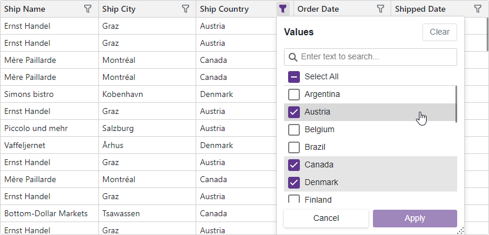

<!-- default badges list -->

<!-- default badges end -->
# Blazor Grid – Binding to a DevExtreme Data Source with Entity Framework Core

This example uses [Entity Framework Core](https://learn.microsoft.com/en-us/ef/core/) data access technologies to bind the [DevExpress Blazor Grid](https://docs.devexpress.com/Blazor/403143/components/grid) component to a [GridDevExtremeDataSource](https://docs.devexpress.com/Blazor/DevExpress.Blazor.GridDevExtremeDataSource-1).

You can use the [GridDevExtremeDataSource](https://docs.devexpress.com/Blazor/DevExpress.Blazor.GridDevExtremeDataSource-1) class to bind the DevExpress Blazor Grid to a large [IQueryable](https://learn.microsoft.com/en-us/dotnet/api/system.linq.iqueryable-1) data collection. This data source implementation is built upon our [DevExtreme.AspNet.Data](https://github.com/DevExpress/DevExtreme.AspNet.Data) library. When you use this data source, our Blazor Grid delegates data filtering operations to an underlying query provider (such as [EF Core](https://learn.microsoft.com/en-us/ef/core/)) and only loads data required for on-screen display (helps optimize app performance and reduces overall memory consumption).

To use this data source in your next Blazor project, create a [GridDevExtremeDataSource](https://docs.devexpress.com/Blazor/DevExpress.Blazor.GridDevExtremeDataSource-1) class instance and pass your [IQueryable](https://learn.microsoft.com/en-us/dotnet/api/system.linq.iqueryable-1) data collection as the constructor parameter. Once complete, assign this instance to the Grid's Data property. Refer to the following help topic for additional information/technical guidance: [Bind Blazor Grid to Data](https://docs.devexpress.com/Blazor/403737/components/grid/bind-to-data#large-data-queryable-collections).

## Files to Review

- [Index.razor](./CS/BindGridToLargeData/Components/Pages/Index.razor)
- [Index.razor.css](./CS/BindGridToLargeData/Components/Pages/Index.razor.css)
- [Invoice.cs](./CS/BindGridToLargeData/Models/Invoice.cs)
- [NorthwindContext.cs](./CS/BindGridToLargeData/Models/NorthwindContext.cs)
- [Program.cs](./CS/BindGridToLargeData/Program.cs)

## Documentation

- [Bind Blazor Grid to Data](https://docs.devexpress.com/Blazor/403737/components/grid/bind-to-data)
- [Bind Components to Data with Entity Framework Core](https://docs.devexpress.com/Blazor/403167/common-concepts/data-binding/bind-components-to-data-with-entity-framework-core)

## More Examples

- [How to bind the Grid to a DataTable object](https://github.com/DevExpress-Examples/blazor-grid-bind-to-datatable-object)
- [How to bind the Grid to data with Entity Framework Core](https://github.com/DevExpress-Examples/blazor-dxgrid-bind-to-data-with-entity-framework-core)
- [How to bind the Grid to an Instant Feedback data source and enable edit operations](https://github.com/DevExpress-Examples/blazor-dxgrid-bind-to-instant-feedback-data-source)
- [How to bind the Grid to a Web API service](https://github.com/DevExpress-Examples/blazor-DxGrid-Bind-To-Web-Api-Service)

<!-- feedback -->
## Does this example address your development requirements/objectives?

 

(you will be redirected to DevExpress.com to submit your response)
<!-- feedback end -->
